# Powers

Nineteen of them, bought with ROX from the E-SHOP. This page says what each actually does
and what you should expect to see, because the shop row is one line and that has not been
enough.

**You are the rock.** The things you smash are the AXIOM's ships — the Pointy Ones, if you
have read [the lore](LORE.md). Most of them are plain, uncoloured chevrons. Four **coloured**
ones (BLUE, YELLOW, GREEN, RED) have personalities and are what the bosses are made of. A
**veteran** is a ranked ship with weapons of its own. Where a row below says *ship*, it
means one of theirs; where it says *rock*, it means you. And a rock is never dead — it is
**lost**, which is a different thing, and [the lore](LORE.md) says why.

**Buy as many as you like. You can equip four at once.** Seven of the nineteen answer a key;
the other twelve just work. The shop marks every row **KEYED** or **ALWAYS ON** before you
spend anything, and says whether a purchase went straight into a slot or is waiting for one.

All four show in one bar along the bottom of the screen — abilities with their key and a
cooldown ring, always-on ones with whatever they are doing:

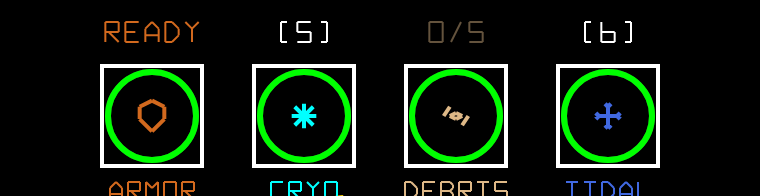

The digits only ever land on things you can press. Equip a passive first and it takes a box
without taking a key, so `5` still fires the first real ability — you will never press a
number and have nothing happen.

---

## The seven that answer a key

The icon in each row is the one the bar draws. The E-SHOP shelf draws a different one for
every power-up — [both sets, side by side](media/powers/icons-both.png) — which is a bug, and
is written down.

They take <kbd>5</kbd> <kbd>6</kbd> <kbd>7</kbd> <kbd>8</kbd>, in the order you have them,
with the cooldown drawn as a ring around the icon. On a controller, <kbd>X</kbd> fires the
next ready one and moves along — that is the pad's only route to an ability, since it has no
number row.

| | | ROX | Cooldown | What it does | What you see |
|---|---|---|---|---|---|
| 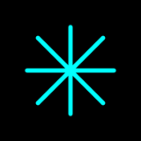 | **CRYO-VENT** | 400 | 8s | A shotgun of ice shards. Short range, heavy damage | The shards |
| 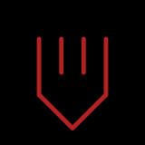 | **LODESTONE PULL** | 300 | 12s | Hauls **you** at the nearest ship. It is your rock that moves, and hard; theirs stays put | You lurch |
| 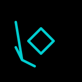 | **SLINGSHOT MANEUVER** | 350 | 15s | Throws you sideways past the nearest coloured ship, fast, and turns you to face the new heading | You move — hard |
| 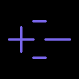 | **POLARITY SHIFT** | 350 | 18s | Shoves every ship near you away, and their shots with them | The ships scatter |
| 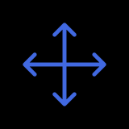 | **TIDAL LOCK** | 400 | 20s, lasts 5s | Ships close to you are forced to face away, and slowed | **A blue ring pulsing around you** — its edge is exactly how far the effect reaches |
| 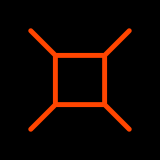 | **THERMAL EXPANSION** | 450 | 25s, lasts 4s | **Your rock doubles in size** and touching anything wrecks it | The rock growing, wrapped in **an orange glow** |
| 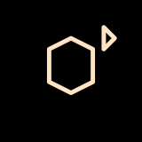 | **BINARY SYSTEM** | 450 | 30s | A moon appears and orbits you, blocking shots | **The moon**, until something kills it |

**Every one of them, when it fires**, puts a coloured ring on your hull for a moment, throws
a banner across the middle of the screen with its name, and makes a sound. If you press the
key and get none of that, it was still on cooldown.

⚠ **SLINGSHOT MANEUVER needs a coloured ship on screen.** With none, it fires, spends its
cooldown, and does nothing at all. That is a bug, it is written down, and it will be fixed.

---

## The twelve that just work

Nothing to press. Some of them show you something; several are completely silent, which is
noted honestly below.

| | | ROX | What it does | What you see |
|---|---|---|---|---|
| 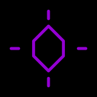 | **ROCHE LIMIT** | 500 | Any plain ship that touches you comes apart. The coloured ones and the veterans are immune | **A purple dashed ring** around you — its edge is exactly the kill radius |
|  | **REGOLITH ARMOR** | 350 | Absorbs the first shot that hits you, once every 10s | **Brown dust orbiting you** while it is charged, and the HUD says ready or recharging |
|  | **ACCRETION DISK** | 400 | Every ship you smash adds a piece of debris. At five it flings them all outward as shots and starts over | A debris count in the HUD, green when it is ready |
| 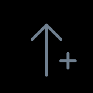 | **HEAVY METAL ENRICHMENT** | 500 | +5% mass per veteran you fell. Mass is what resists a shove | Your mass bonus in the HUD |
| 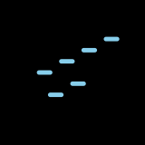 | **SUBLIMATION TRAIL** | 300 | Leaves gas that makes their ships turn worse | **A pale blue trail** behind you, fading |
|  | **KESSLER SYNDROME** | 450 | Ships you smash leave wreckage that hurts the rest of the AXIOM | **Drifting debris** where you smashed them |
| 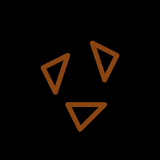 | **RUBBLE PILE** | 400 | When a shot would finish you, you scatter into pieces instead. Gather three of five in time and you reform | **Your rock coming apart, and the pieces you have to fly back into** |
|  | **PROPULSION UPGRADE** | 150 each | Raises how far your throttle keys wind, up to three times | The thrust and spin numbers |
|  | **IRIDIUM CORE** | 300 | You plough through their ships instead of bouncing off, and a hit no longer shoves you | The box says ACTIVE. You notice by not bouncing |
|  | **VANTABLACK CARBON** | 250 | Their ships notice you at half the distance | The box says ACTIVE — in vantablack, so you cannot read it |
|  | **ELASTIC COLLISION** | 200 | Every bounce adds 10% speed | The box says ACTIVE |
| 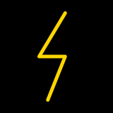 | **LORENTZ FORCE** | 350 | Deflects their lasers when you are moving fast | The box says TOO SLOW until you are, then DEFLECTING |

⚠ **The last four tell you almost nothing.** They are working — they change how the game
behaves — but ACTIVE over a box only says it is equipped, not that it did anything, and
VANTABLACK's word is drawn in its own colour. Only LORENTZ reports a condition. That is a gap
we know about.

⚠ **RUBBLE PILE only catches a shot.** If what finishes you is a ram or a veteran's
missile, it does nothing and you are lost as usual. That is a bug, it is written down, and it
will be fixed.

---

## Seen in the game

Every picture here is the real game, staged and recorded by the same tools that shot the
trailer: a level dealt, the power-up equipped, the AXIOM arranged so there is something for
it to act on, and the key pressed. Nothing is drawn by hand.

<table>
<tr><td width="50%" valign="top">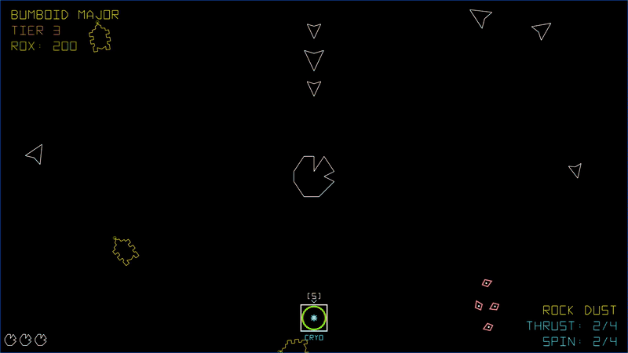 <b>CRYO-VENT</b> — Three ships parked ahead, one press of <kbd>5</kbd>: the banner, the pulse on the hull, and the shards.</td><td width="50%" valign="top">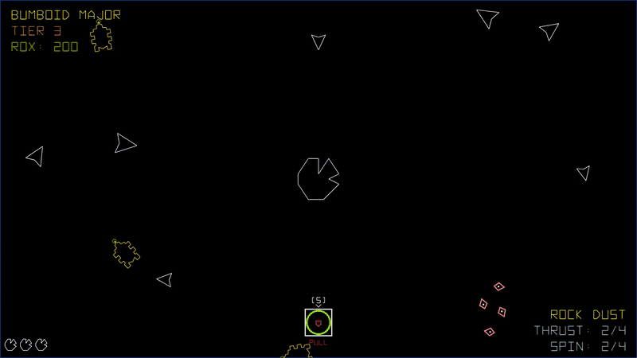 <b>LODESTONE PULL</b> — One ship placed off to the side. Press <kbd>5</kbd> and it is the rock that goes — hard, and then keeps going.</td></tr>
<tr><td width="50%" valign="top">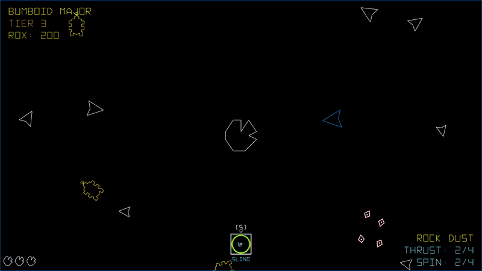 <b>SLINGSHOT MANEUVER</b> — A BLUE off to the right. Press <kbd>5</kbd>: sideways past it, fast, facing the new heading.</td><td width="50%" valign="top">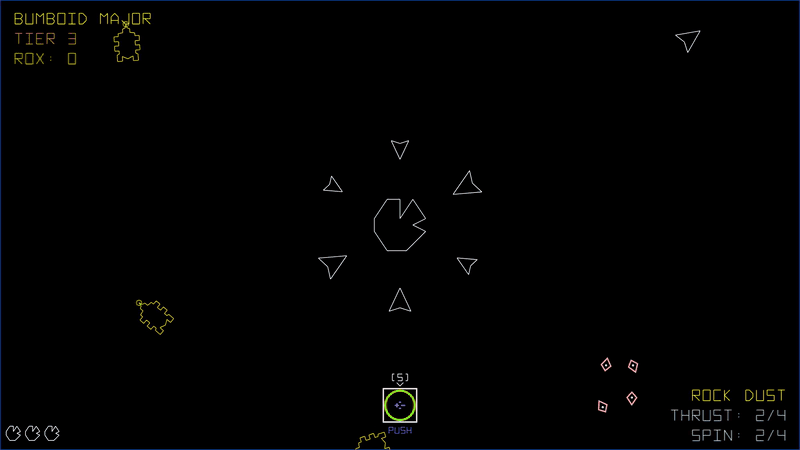 <b>POLARITY SHIFT</b> — Six ships in close. Press <kbd>5</kbd> and they are not.</td></tr>
<tr><td width="50%" valign="top">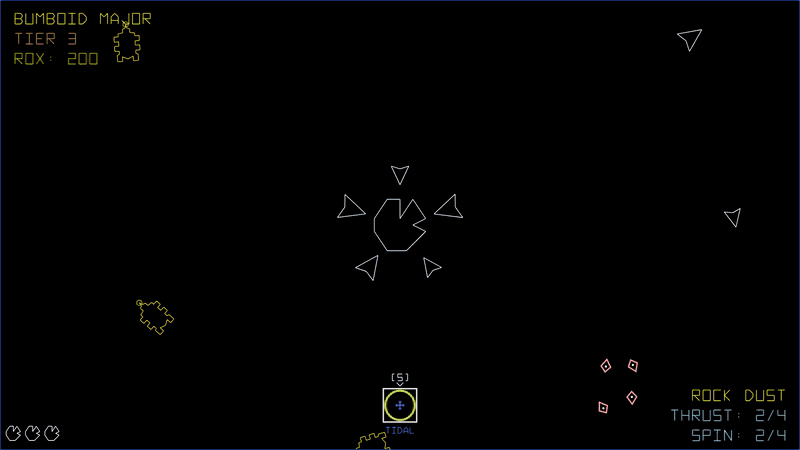 <b>TIDAL LOCK</b> — Five ships inside the ring, every one turned away and slowed, for five seconds.</td><td width="50%" valign="top">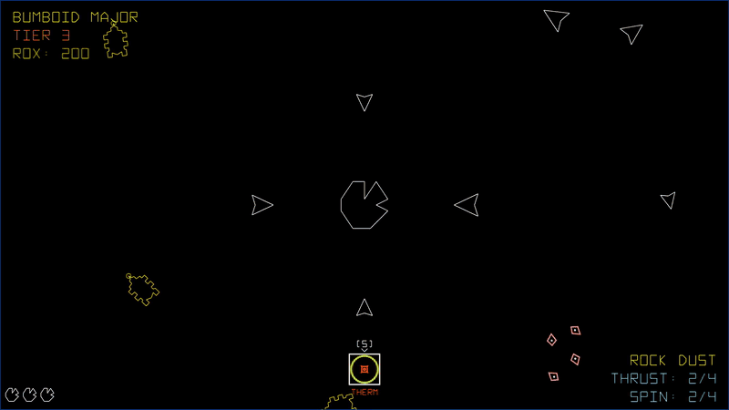 <b>THERMAL EXPANSION</b> — Twice the rock, an orange edge, four seconds.</td></tr>
<tr><td width="50%" valign="top">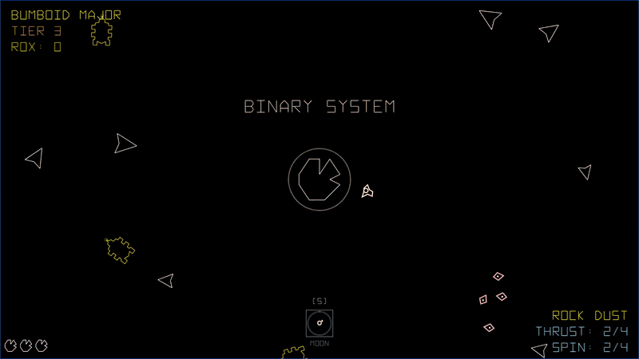 <b>BINARY SYSTEM</b> — The moon. It is small, it is quick, and it is between you and their shots.</td><td width="50%" valign="top">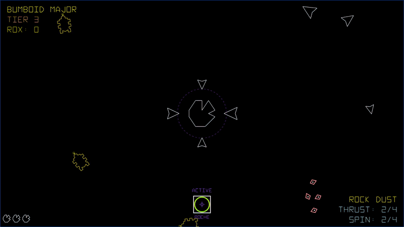 <b>ROCHE LIMIT</b> — Four plain ships drift into the purple ring and come apart on the line.</td></tr>
<tr><td width="50%" valign="top">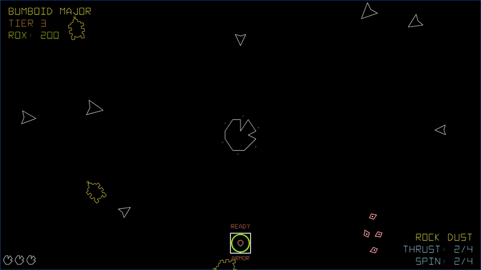 <b>REGOLITH ARMOR</b> — READY over the box and brown dust round the hull while it is charged. The ship off to the side fires two seconds in.</td><td width="50%" valign="top">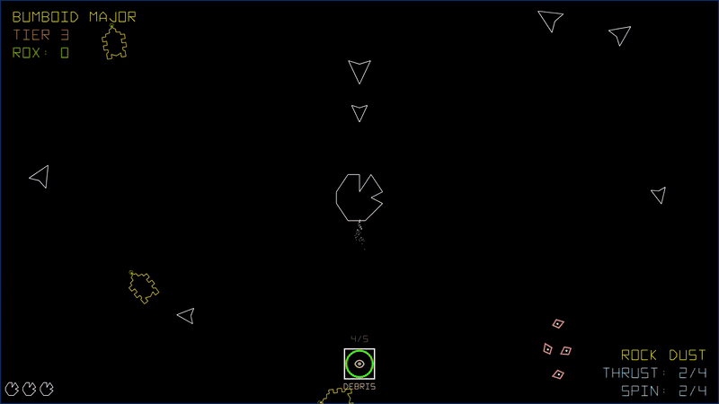 <b>ACCRETION DISK</b> — Four of five held. The smash ahead makes five, and the debris goes out as shots.</td></tr>
<tr><td width="50%" valign="top">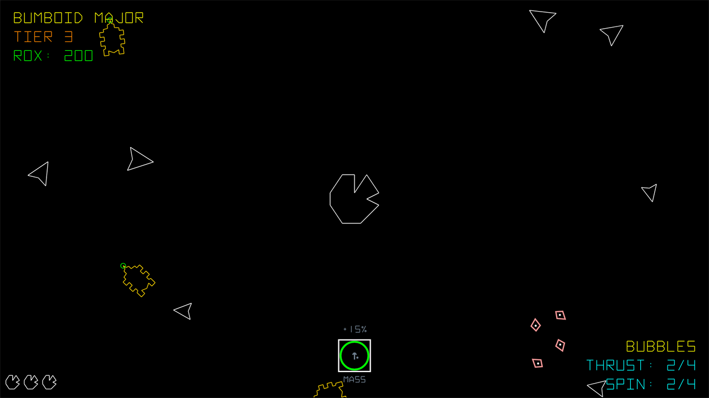 <b>HEAVY METAL ENRICHMENT</b> (still — nothing to film) — Three veterans felled: +15% over the box.</td><td width="50%" valign="top">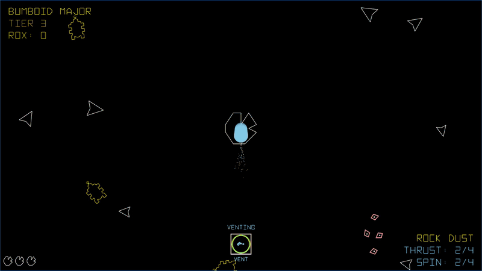 <b>SUBLIMATION TRAIL</b> — Under thrust, turning: the trail, and the box reads VENTING.</td></tr>
<tr><td width="50%" valign="top">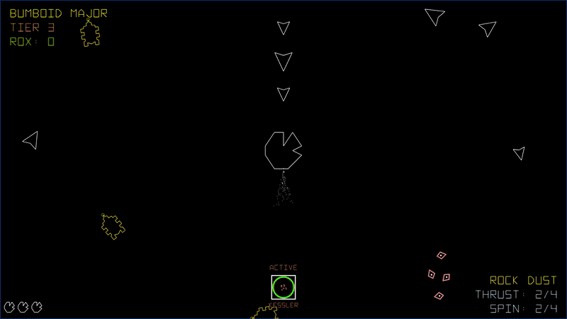 <b>KESSLER SYNDROME</b> — Three ships smashed in a line, and the sienna wreckage left where each one was.</td><td width="50%" valign="top">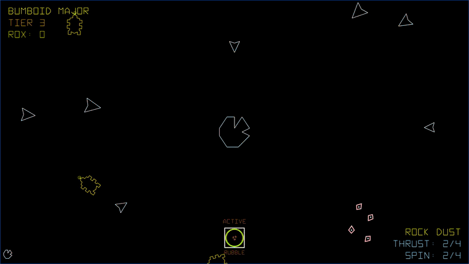 <b>RUBBLE PILE</b> — One hit point, one shot. The rock comes apart and the clock starts.</td></tr>
<tr><td width="50%" valign="top">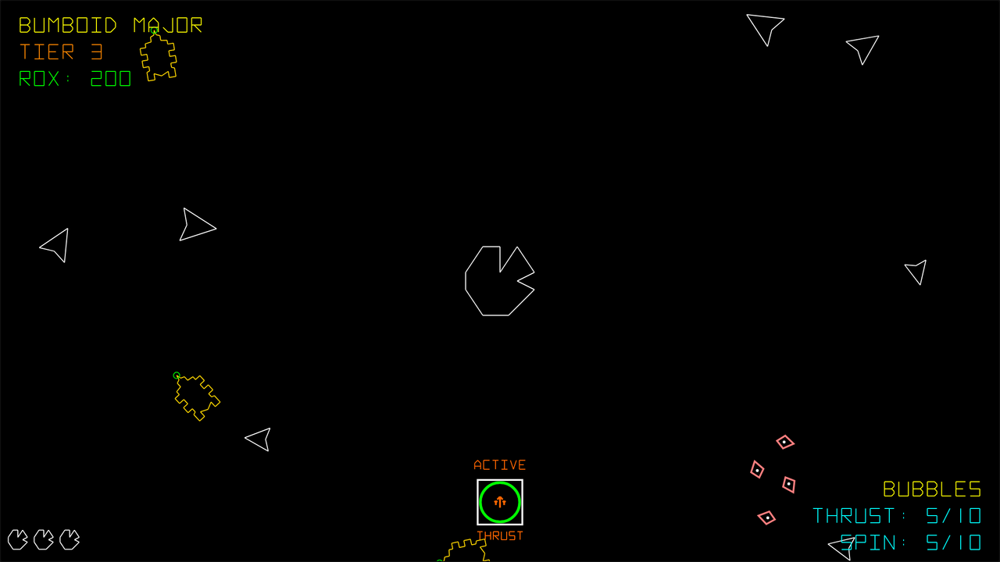 <b>PROPULSION UPGRADE</b> (still — nothing to film) — Three buys: THRUST 5/10 and SPIN 5/10, where a fresh rock reads 2/4.</td><td width="50%" valign="top">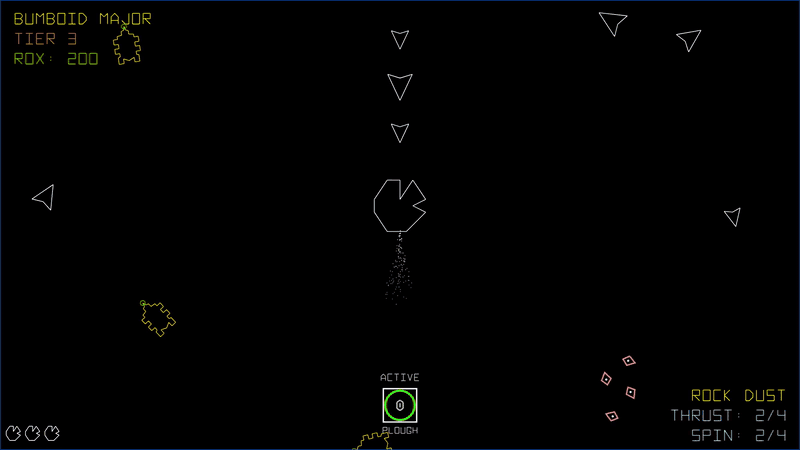 <b>IRIDIUM CORE</b> — Straight through three ships. Nothing to see but the absence of a bounce.</td></tr>
<tr><td width="50%" valign="top">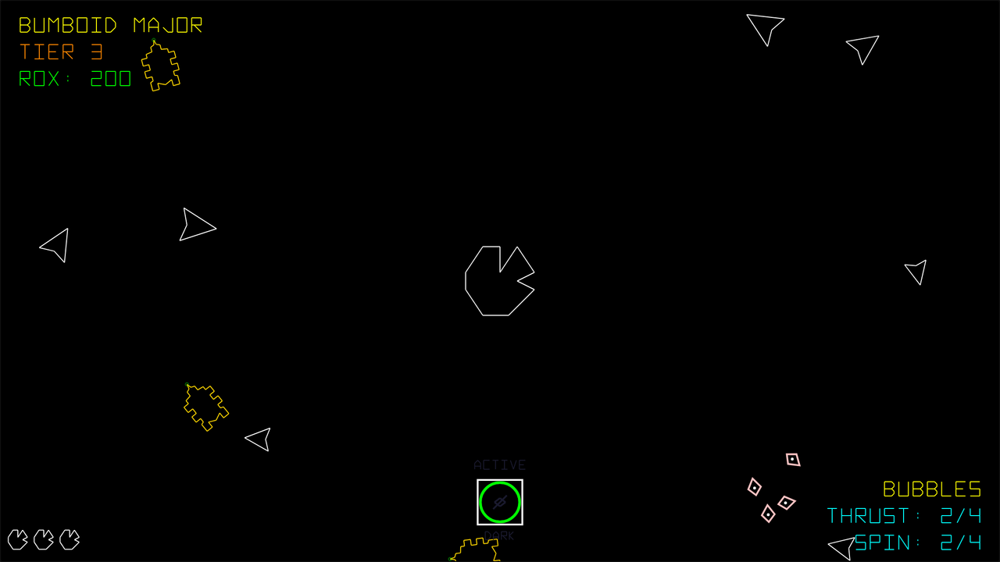 <b>VANTABLACK CARBON</b> (still — nothing to film) — The box, with its word in vantablack.</td><td width="50%" valign="top">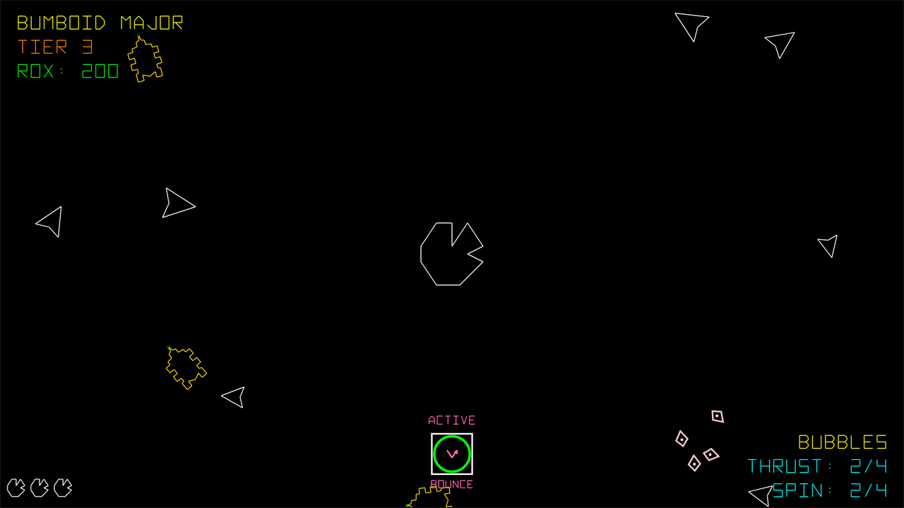 <b>ELASTIC COLLISION</b> (still — nothing to film) — ACTIVE, and that is all it will ever say.</td></tr>
<tr><td width="50%" valign="top">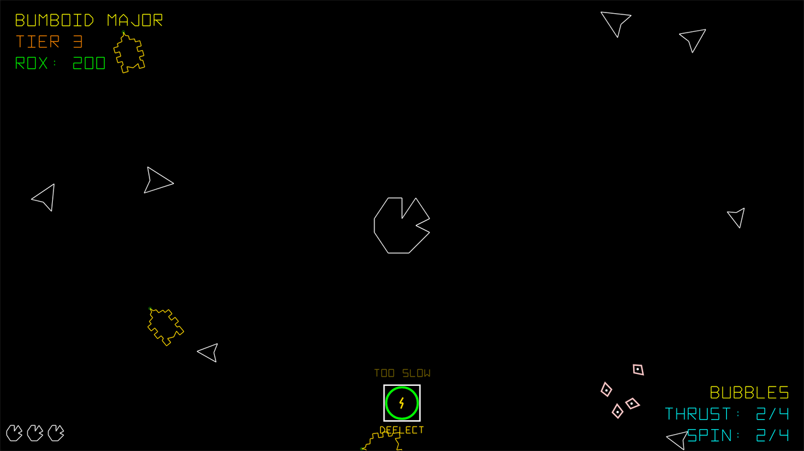 <b>LORENTZ FORCE</b> (still — nothing to film) — TOO SLOW, until you are not.</td></tr>
</table>

---

## One bar, not two corners

It used to be two: a row of abilities along the bottom and a separate list of passives at
the top left. Both were correct and you had to know both existed to know what you were
carrying, which is most of why this was confusing. Now it is one bar with a box per equipped
power-up.

Above each box, an ability shows its key and a passive shows what it is *doing* —
`READY` or a countdown for REGOLITH ARMOR's shield, `0/5` for ACCRETION DISK's debris,
`+15%` for HEAVY METAL's mass. An empty bar says so, and means you have nothing equipped.

---

## The part that is still awkward

**There are seven keyed abilities and four slots.** Better than three, but buy a fifth and it
sits in your inventory doing nothing until you unequip something — and the shop does not warn
you at the counter.

Whether four is right is still open. Four forces a choice; the keyboard has room for more. If
you have an opinion, press <kbd>B</kbd> and say so.
