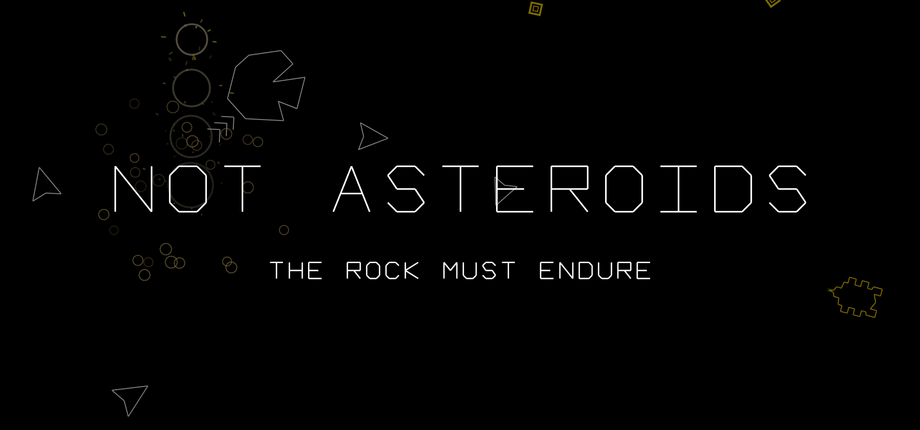

# NOT ASTEROIDS

> ### 🚧 Currently in BETA testing
>
> The game is playable start to finish, in a browser, with nothing to install. It is not
> finished, there is no release date, and it is not open to the public yet — right now it
> exists for the people testing it, who already have the link.
>
> **If that is you: [start here →](BETA.md)**

You cannot shoot. You sculpt a rock, bolt a thruster to it, and ram the geometry that is
trying to file the universe into a spreadsheet.

You are a **Lithonaut**: a tardigrade-fungal collective flying a shell of sculpted stone.
The enemy is **The Axiom**, which believes the universe is a spreadsheet with rendering
errors, and is working through them.

> There is no weapon. A weapon is a way of disagreeing at a distance.

You are carrying no armament, and that is the design rather than a limitation waiting to be
lifted. Nothing in the shop sells you one. There is no upgrade tree that ends in a better
way to kill something from far away.

It is worth saying out loud that this is a game about a rock, and that
[weaponising space is still a bad idea](https://www.ethicsandinternationalaffairs.org/online-exclusives/the-cosmic-precipice-why-weaponizing-space-hurts-us-all)
in the world where the rest of us live.

---

## This repository has no code in it

The game is developed privately. What lives here is the **public face**: what the game is,
what is in it, and the bug reports and suggestions that beta testers file from inside it.

If you are playing and something is wrong — or you just want something different — press
<kbd>B</kbd>. That is the whole process. [How reporting works ↓](#press-b)

---

## Smash, because there is no weapon

Momentum is all you have. You line the rock up and you commit, and the hull keeps every
dent you collect on the way — which is the honest version of a fight: you do not get to
stay clean, and you do not get to do it from over there.

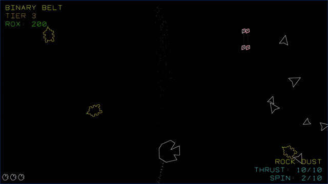

## Cut the hull you fly

Ten strikes of acidic spit shape a fresh rock. The silhouette you carve is the hitbox you
keep for the rest of the run — there is no separate "collision shape" being kind to you.

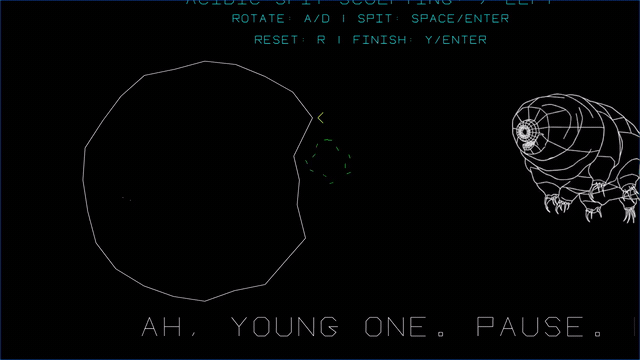

## Nineteen thrusters, no apology

Cosmetic, cyclable mid-flight with <kbd>T</kbd>, and most of why the game looks the way it
does.

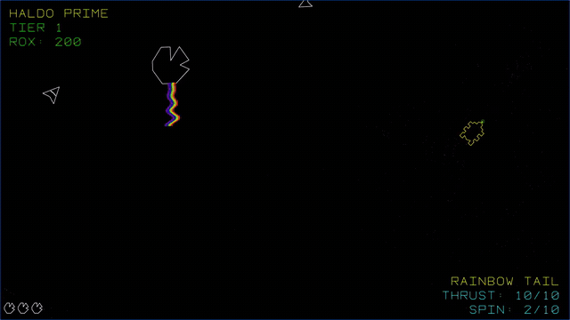

One of them, **PI TAPE**, stamps a digit of π into the playfield every character-width you
fly and leaves it there to fade — so your exhaust trail is a legible record of the path you
actually took.

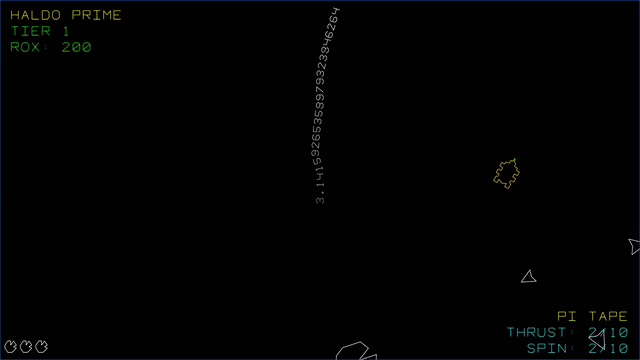

## Spend ROX on things that are not weapons

Nineteen power-ups, five hats a veteran AXIOM ship can steal off your hull, and a salvaged
AXIOM module behind the counter that is legally barred from selling you anything and does
it anyway.

Seven of the nineteen answer a key; the rest just work. **[POWERS.md](POWERS.md)** says what
each one does and what you should expect to see — including the four that show you nothing
at all, and the one that currently fires and does nothing if there is no coloured enemy
about.

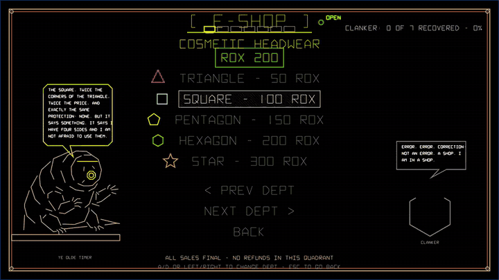

## Read the chart like a transit map

Eleven systems in three regions, dealt fresh for every save slot. The routes run at proper
transit-map angles, each region is its own coloured line, and the stations where you change
lines are ringed. The regions do not connect: the arms between them are interrupted by a
mouth, because the way across is not a jump — it is the road.

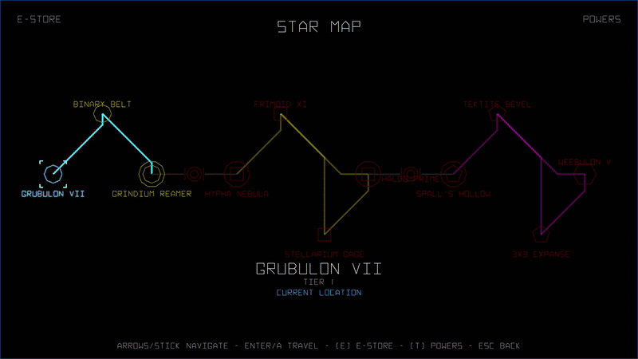

The cursor rides the lines rather than crossing the void, and your rock sits on the map and
**flies its own jumps** — under thrust, along the line as drawn, elbow and all.

## And then the road stops being a map

Clear a region and the win card puts you back in the playfield with the road's mouth
standing in it. Fly in.

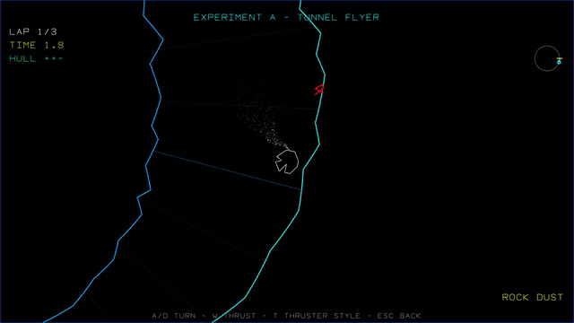

You do this three times a game and the bore is not the same twice: the first run is a
boulevard, the second is tighter, and the last one is the tunnel every tester already knows
— the walls arriving faster than the confidence does. If that curve is wrong for you,
**TUNNEL BORE** in the difficulty settings scales all three at once without flattening the
progression between them.

The last run does not surface anywhere. It delivers you across the singularity boundary of
three black holes in mutual orbit, hull pulled flat crossing the line, into the battle
waiting on the inside.

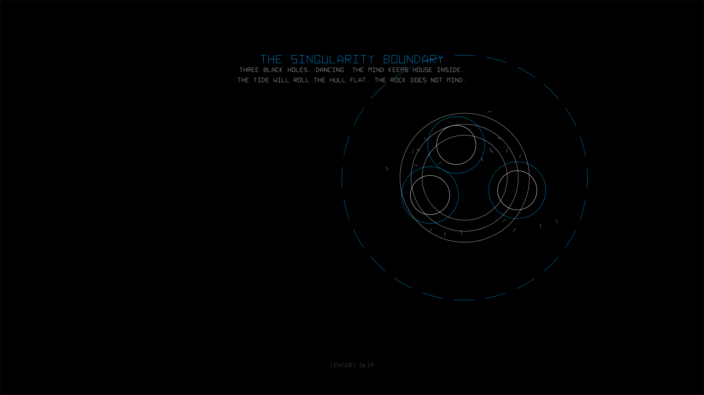

---

## The five legs

Five games ship in here, and they are one story played in order.

| | Leg | What it is |
|---|---|---|
| **1** | **THE STAR MAP** | The war, and the part with the hours in it. Eleven systems in **three regions**, taken one at a time, each with a boss that has a personality. |
| **2** | **THE TUNNEL** | Not a destination — the passage. It runs **between** the regions, three times, and the bore narrows on every visit. It sings, because everything does. |
| **3** | **ARCHNOTOIDS** | The last run of the road ends at three black holes orbiting each other, with the AXIOM's central mind running on everything falling past them. You are close enough that the tide has rolled your hull flat — which is why this one is played with a paddle. |
| **4** | **THE GRAVITY FIELD** | You win, and what is left is you: a sentient rock in an open field, gathering other rocks, cooling. Accreting makes you pull harder, and the only way to put the load down is to let go of it. |
| **S** | **SPACE TRASH** | Every loss on every leg falls here, among everything the AXIOM ever threw away. Hold out and it puts you back where you fell. Break up in here and the run is over. |

**Lost, not dead.** A rock does not die. It goes to spore state, or it is *lost* — mislaid,
discarded, downhill. The trash is where lost things are, and it is not a punishment. It is
only where things end up.

### The shape of a run

```
REGION 1 (3)  →  loop 1  →  REGION 2 (4)  →  loop 2  →  REGION 3 (4)  →  loop 3  →  ARCHNOTOIDS  →  THE GRAVITY FIELD
                                                                                 the singularity
                                                                                    boundary
```

A cleared region does not put you on a menu. The win card ends back in the playfield, where
the road's mouth is standing, and **flying into it** is how you leave. A doorway you take,
not a line you dismiss.

**The galaxy is dealt, not authored.** Every save slot rolls its own systems — names from a
grammar written in the game's own voice, and a chart generated inside each region under a
fixed set of rules. HALDO PRIME and NEW SYNAPTICON are still canon and still turn up; their
new neighbours sound like they were always on the shelf beside them.

**Three tries per level, then the run is over.** Fall, and SPACE TRASH asks you to survive a
drift to get back in: 1500 m the first time, 3000 the second, 6000 the third. Clear the
level honestly and its tally is forgiven. Fall a fourth time and the run ends.

**And then you keep the money.** A run that ends resets the chart and your position — a new
galaxy, rolled fresh — but **your ROX, your power-ups and your hats ride across**. Progress
resets; the purse does not. We are heathens now.

The whole thing — the extremophile that had to be the one left standing, the slow fade that
emptied the Earth without a single catastrophe, the thermal oasis AXIOM built by accident,
and why the rocks were already singing before any of it — is in
**[LORE.md](LORE.md)**. None of it is required reading; the game never stops to explain
itself.

---

## Screenshots

| | |
|---|---|
| 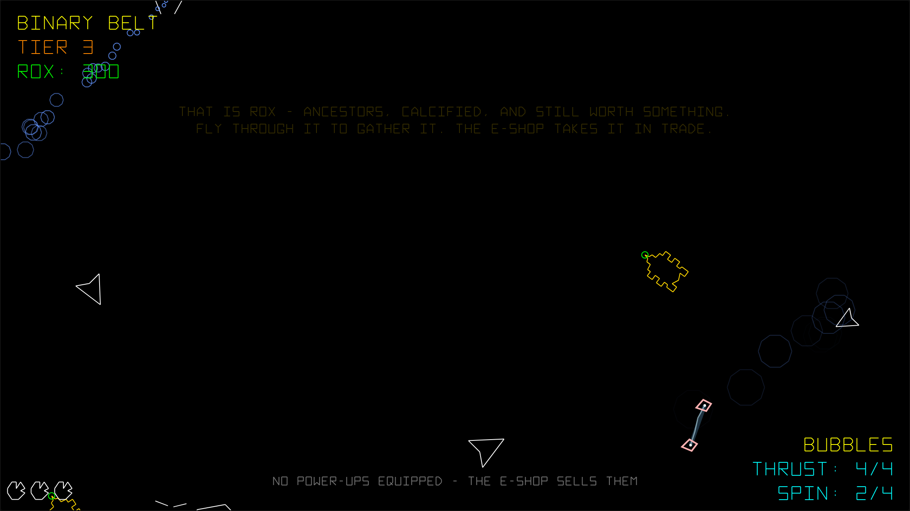 | 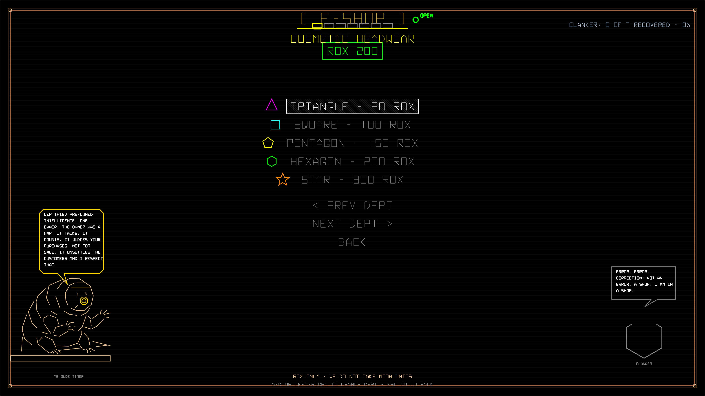 |
| *Tier 3, mid-smash. The HUD is two corners and nothing else.* | *The counter, and the module that runs it.* |
| 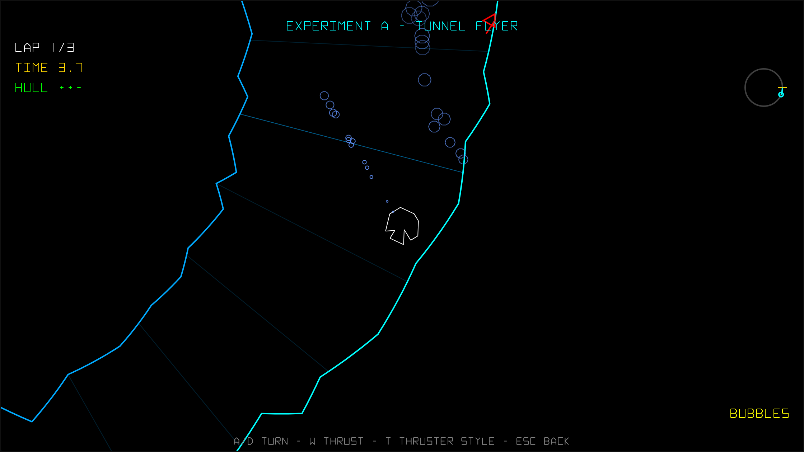 | 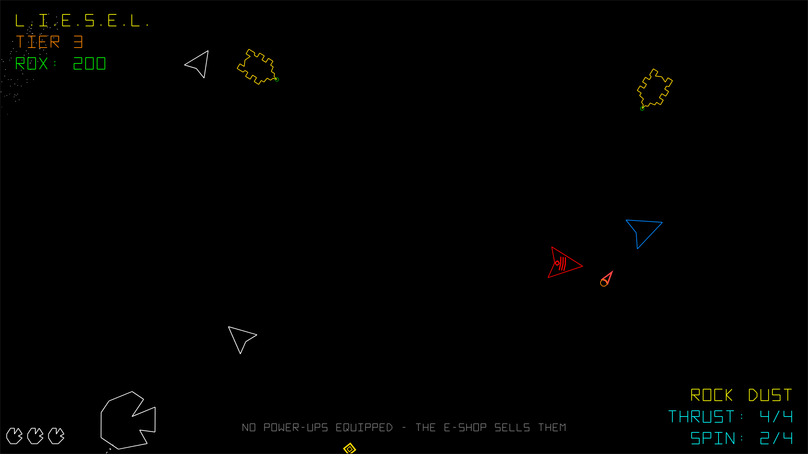 |
| *The last loop. It sings.* | *Bosses have personalities, weapons and escorts.* |
| 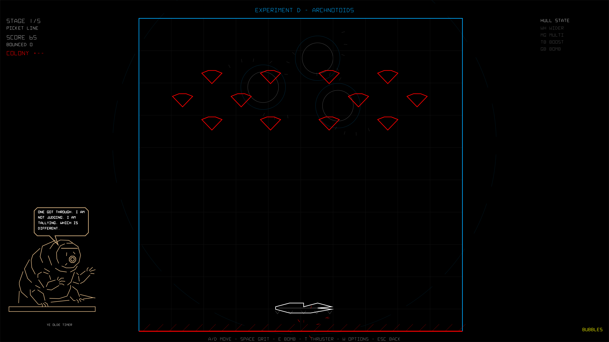 | 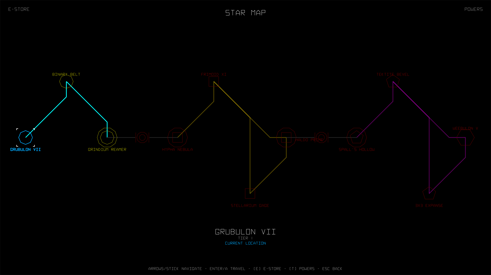 |
| *Leg 3, played flat, for a reason the story gives.* | *Eleven systems, three lines. The jump drive needs the local boss dead.* |
| 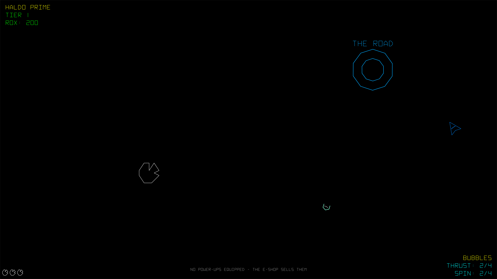 | 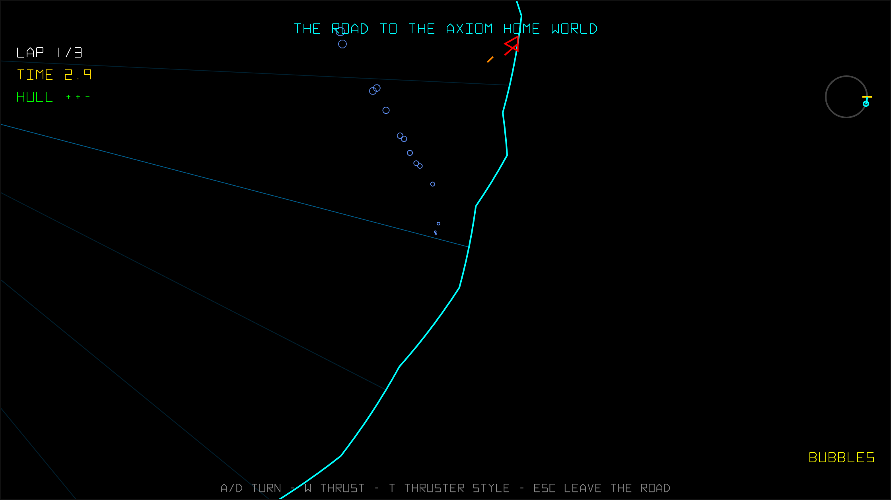 |
| *A cleared region ends here. Fly in.* | *Loop one is a boulevard. It does not stay one.* |
|  | |
| *The tide takes the hull at the line.* | |
| 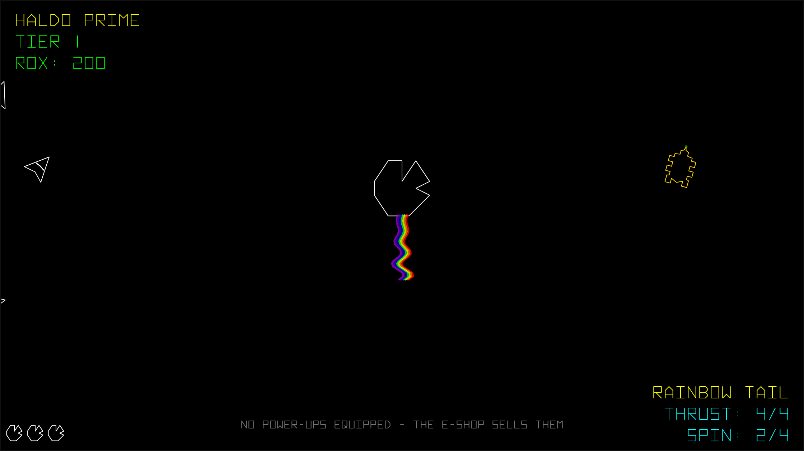 | 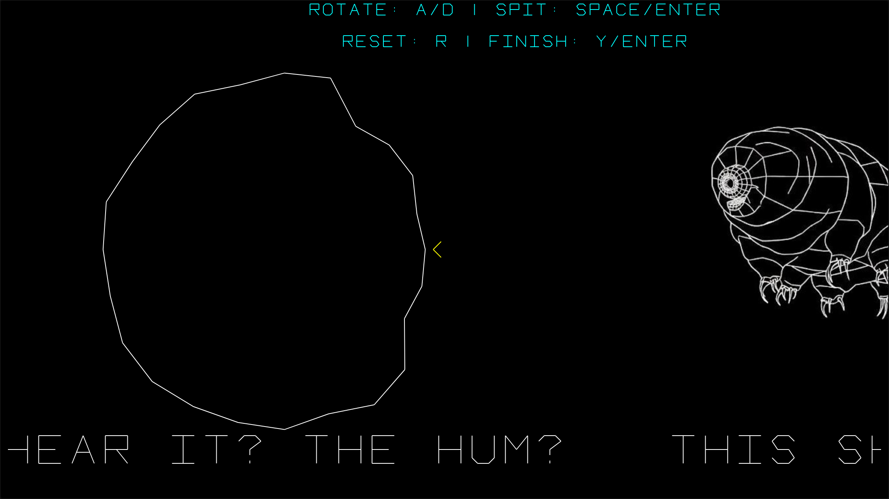 |
| *One of nineteen.* | *Ten strikes. What you cut is what you fly.* |
| 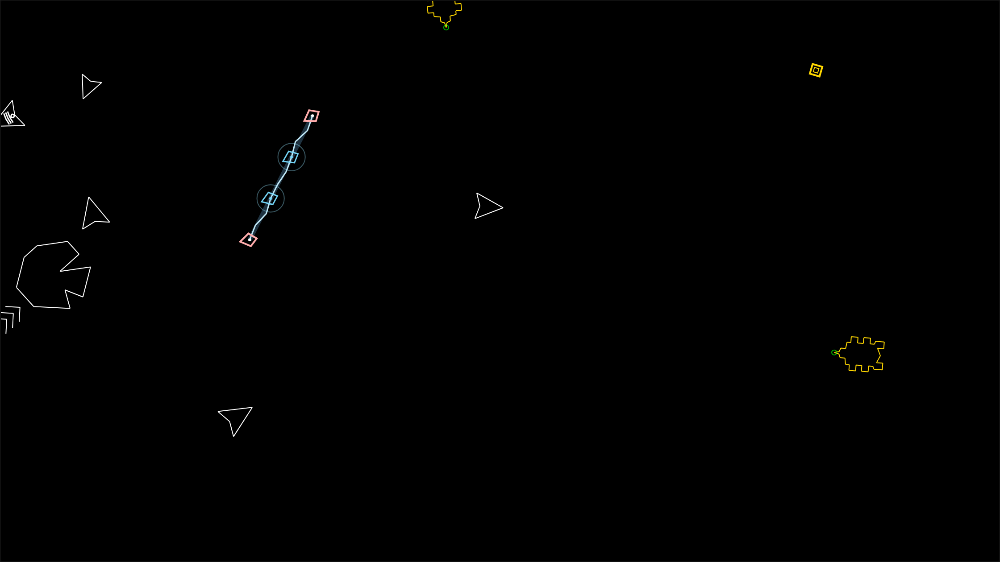 | 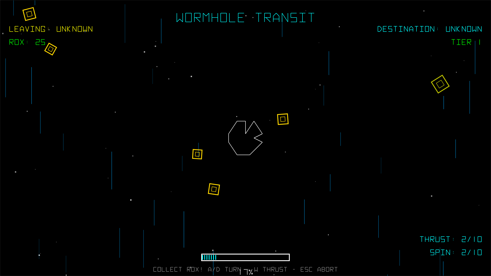 |
| *<kbd>Z</kbd> takes the instruments off and leaves the rock alone in the dark.* | *Between systems.* |
| 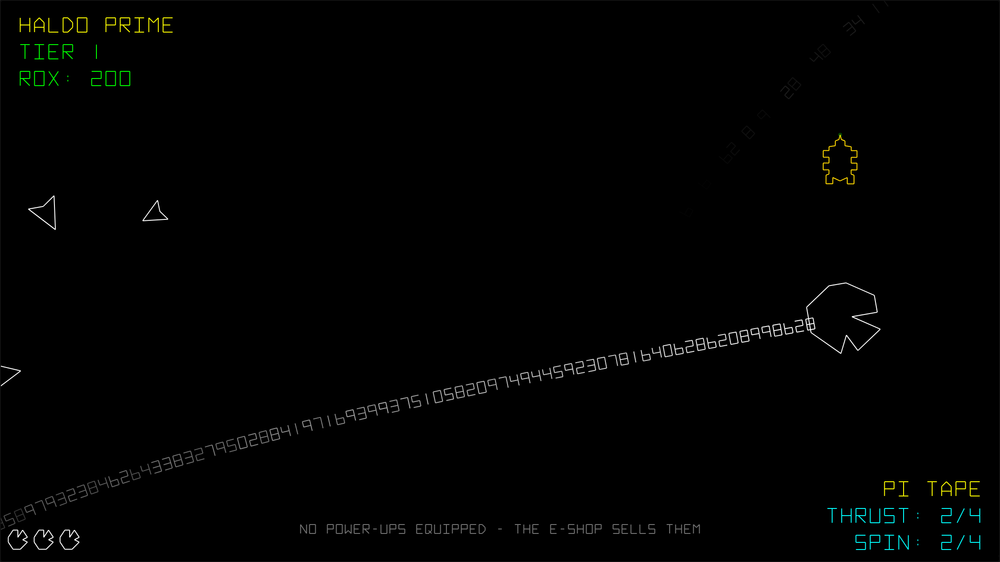 | |
| *The trail is the path, written down.* | |

There is also a [trailer](media/trailer.mp4) in here. GitHub will not play it inline, so
you will have to download it to watch it.

---

## Controls

Enough to start. The full table, including the gamepad column, is in
**[CONTROLS.md](CONTROLS.md)**, and on the game's own CONTROLS screen from the main menu.

| | |
|---|---|
| <kbd>W</kbd> <kbd>A</kbd> <kbd>S</kbd> <kbd>D</kbd> / arrows | Thrust and steer |
| <kbd>Space</kbd> / <kbd>Enter</kbd> | Eject, confirm |
| <kbd>5</kbd> <kbd>6</kbd> <kbd>7</kbd> <kbd>8</kbd> | Fire power-up slot 1–4 |
| <kbd>E</kbd> | Open the E-STORE (from the star map) |
| <kbd>T</kbd> | Cycle thruster style |
| <kbd>F</kbd> | Cycle vector font |
| <kbd>1</kbd> <kbd>2</kbd> | Throttle down / up |
| <kbd>-</kbd> <kbd>+</kbd> | Spin rate down / up |
| <kbd>Z</kbd> | Zen mode — instruments off |
| <kbd>B</kbd> | File a bug or a suggestion |
| <kbd>Esc</kbd> | Pause |

Full controller support. The pad has no digits, so <kbd>X</kbd> fires each equipped ability
in turn rather than pretending to be a number row — and on the keyboard the slot keys are
the whole story, because a single "fire the next ready one" key turned out to be a way of
not knowing what you had just used.

**It plays on a phone.** Touch is a real second layout rather than a fallback: on-screen
controls, a portrait star map that runs the regions down the long axis, and the same game
underneath.

---

## What is actually in it

Counted from the code, not from a wishlist.

* **11 star systems** in three regions, generated per save slot, each with a boss
* **3 tunnel runs** per game, between the regions, the bore narrowing each time
* **19 thruster styles**, cosmetic, cyclable mid-flight
* **19 power-ups**, four equipped at once
* **19 vector fonts** — everything drawn as line segments, including the text
* **5 hats**, which a veteran AXIOM ship can steal off your hull and then wear
* **9 save slots**, local to your browser
* **A settings maze** — every tunable parameter of the game is one entry in one registry, and the pages, the persistence and the tests all derive from it
* **THE CONTROL ROOM** — most of those levers are behind a door you have to fly a rock through, and the key to it is in three pieces, lying on the floor of a fourteen-room mansion
* **THE SOUND LAB** — audition every sound effect, and pin the variant you like
* **A narrator you can change, and make unreliable** — voices may notice things about your run, and may be wrong about them. The seed stays exempt: a wrong seed is a broken feature, not a joke.

### Accessibility

Adjustable HUD scale, HUD opacity and text density. ARCHNOTOIDS — the paddle leg — has its
own high-contrast and colourblind-safe modes, plus a sensitivity dial.

Being straight about the limits of that: the colourblind option is **specific to
ARCHNOTOIDS** and does not restyle the rest of the game, which still leans on a small set
of saturated colours on black. If that is a problem for you, say so with <kbd>B</kbd> — it
is a fair thing to want and nobody has asked yet.

What is a firm rule: anything that exists to stop requiring an ability is never locked
behind THE CONTROL ROOM. Reaching that room means flying a rock through a doorway, which
is exactly the ability those settings exist to stop requiring.

---

<a name="press-b"></a>

## Press B

The reporter is built into the game. Press <kbd>B</kbd> during play, type what happened,
and it goes straight to the machine that serves the game.

*Testing the game? **[BETA.md](BETA.md)** is the fuller version of this — what is worth
sending, what is out of scope, and the one habit that makes a report actionable.*

* **No account.** You do not need one, and there is nothing to sign up for.
* **Nothing about you is stored.** The server keeps what you chose to type and what your
  browser said it was. It deliberately never writes down an address.
* **A snapshot rides along** — which build you were on, which screen you were looking at,
  the level, the seed, your settings and a summary of the run — so that "it froze" arrives
  with enough attached to chase it.

### What happens to it

Every report is read by a human, then transcribed into an **[Issue](../../issues)** here:
quoted exactly as written, with the useful half of its snapshot. Nothing is published
before someone has read it, which is also how we keep track of which ones we have got to.

Then it is triaged against the actual code, so the Issue title may end up describing
something narrower — or wider — than the report did. That has happened more than once:

> *"RUNNING INTO A BOSS WITH LASERS DOES NOT AUTOMATICALLY SHUT DOWN THERE WEAPON"*

...was correct, and the real defect was worse than what was visible from the cockpit. The
orphaned beam was **still lethal** — you could be killed by a weapon whose owner you had
already smashed.

> *"THE PROPULSION UPGRADE IN THE ESHOP IS UNNEEDED"*

...was also correct, and understated. Buying it three times moved your thrust from 2 to 5,
while tapping <kbd>2</kbd> moved it to 10 for free. Not unneeded — dominated.

Labels say where a report got to:

| | |
|---|---|
| `from-game` | Filed with the in-game reporter |
| `bug` / `suggestion` | Which kind it turned out to be |
| `shipped` | Fixed and live |
| `working-as-intended` | Real behaviour, deliberately chosen |
| `parked` | Real, kept, waiting on something else first |
| `moved-to-private` | Now a work item in the private repo, where the code is |

**`moved-to-private` is the normal path, not a dead end.** Nothing gets worked on until it has
been rewritten as an issue against the actual code — with the file, the line and the
reproduction attached — and that has to happen where the code lives. When a report is moved,
the comment on it says what was found in the process, so the trail does not go cold here.

A closed issue names the build the fix went live in. Deploys take about two minutes, so
**shipped** means you can go and look.

---

## Honest notes

Things worth knowing before you spend an evening on it.

**It is in beta, and it deploys constantly.** There is no release date and no store page. A
fix reaches the live game a couple of minutes after it is written, so there is no version
you are "on" for the evening. Your save lives in your browser's local storage, which means
clearing site data clears your runs.

**Online play is unfinished and not being promoted yet.** There is a MULTIPLAYER entry on
the main menu and it does something, but it is a work in progress rather than a feature,
and none of this page is about it. Everything described here is single-player.

**There are no accounts.** No profiles, no logins, no cloud saves, no leaderboards —
nothing to sign up for and nothing to lose access to.

**Some of the audio is AI-generated, ahead of time.** Sound effects from Stable Audio Open
and music from ACE-Step, generated locally, with the prompts and seeds kept alongside the
assets so any of them can be rebuilt. CLANKER's voice is **SAM — Software Automatic Mouth,
1982** — a formant synthesiser, not a model. No AI-generated art ships, and the game makes
no AI calls while you play.

**The letterforms are mostly not ours.** Fourteen of the nineteen vector fonts are
Hofstadter & McGraw's Letter Spirit gridfonts and one is the 1979 Atari *Asteroids* ROM
font, vendored with attribution.

**The title is a joke about a trademark somebody else owns.** It is a browser game on our
own domain, given away.

> The genre itself is settled law, which is a nicer footnote than it sounds. In
> [*Atari v. Amusement World*](https://en.wikipedia.org/wiki/Atari_v._Amusement_World)
> (D. Md., 1981) Atari sued over *Meteors*, an Asteroids-alike, and **lost**. The court
> counted twenty-two similarities between the two games and held they were inevitable to
> the idea of shooting space rocks with a spaceship — an idea nobody gets to own, however
> well they executed it first. That is the precedent games like this one are made under,
> and this one is a good deal further from *Asteroids* than *Meteors* ever was: you cannot
> shoot.
>
> That case is about copyright. A name is a trademark question, which is a different one,
> and we are not pretending otherwise by quoting it here.

---

*The rock must endure.*
